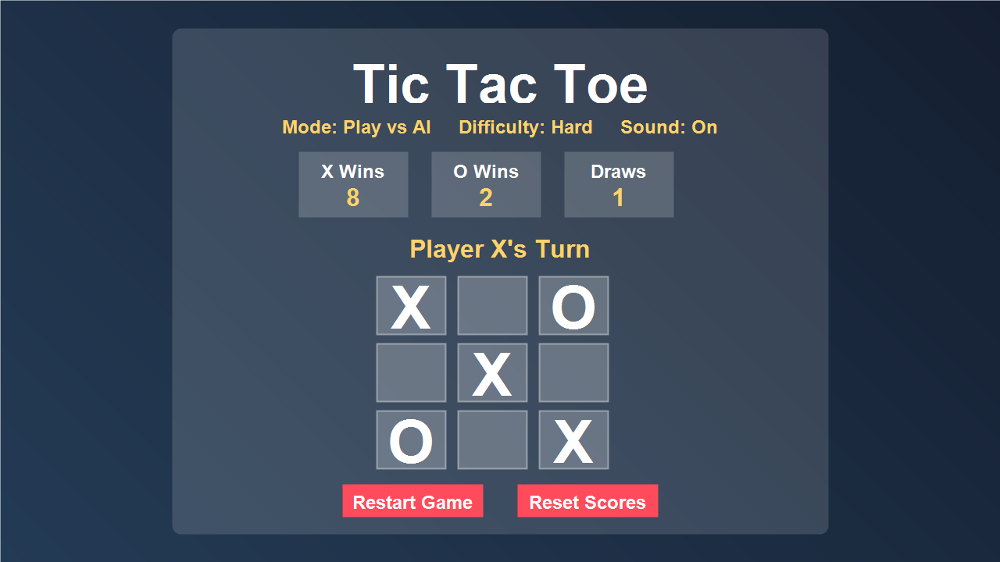

# Tic Tac Toe Game

An interactive Tic Tac Toe game built with HTML, CSS, and JavaScript.

## Live Demo

https://isha-s-landge.github.io/tic-tac-toe-game/

## Features

- Two-player mode
- Play vs AI mode
- Easy, Medium, and Hard difficulty levels
- Hard mode uses the Minimax algorithm
- Winner and draw detection
- Persistent score tracking with localStorage
- Dark and light theme toggle
- Mute/unmute sound control
- Restart game and reset scores actions
- Winner highlight animation
- Responsive one-screen layout

## Technologies Used

- HTML
- CSS
- JavaScript
- localStorage

## What I Learned

- DOM manipulation
- Event handling
- Game state management
- Score persistence with localStorage
- Audio controls in JavaScript
- AI decision-making with Minimax
- Responsive UI design

## Version Progress

- Version 1: Basic Tic Tac Toe game
- Version 2: Improved layout and score persistence
- Version 3: AI opponent mode
- Version 4: Easy, Medium, and Hard difficulty levels
- Version 5: Mute control, win animation polish, README, screenshot, and testing pass

## GitHub Repository

https://github.com/Isha-S-Landge/tic-tac-toe-game